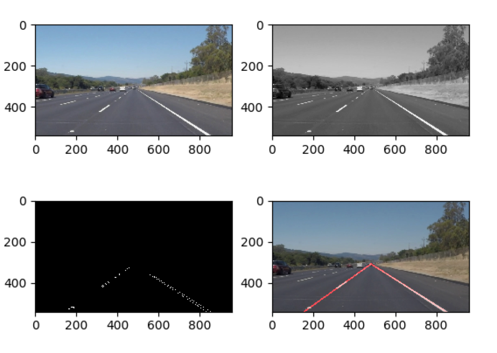
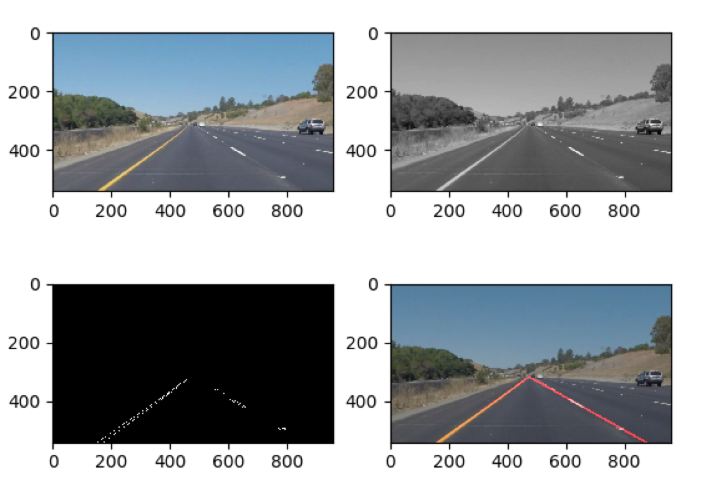

#**Finding Lane Lines on the Road** 

---

**Finding Lane Lines on the Road**

The goals / steps of this project are the following:
* Make a pipeline that finds lane lines on the road
* Reflect on your work in a written report

[//]: # (Image References)

[image1]: ./examples/grayscale.jpg "Grayscale"

---

### Reflection

###1. Describe your pipeline. As part of the description, explain how you modified the draw_lines() function.

This was a great starter project, gave me a good overview of the end-to-end process at a reasonable high level for me to try advanced techniques in the future.

In the code, the nomenclature used is slope ("m") intercept ("b") and (x, y) for coordinates.

My pipeline consisted of the following steps, the modified image get passed through the pipeline steps-

1. Convert the image to the grayscale
2. Apply the Gaussian Blur with a kernel size of 5
3. Find edges using Canny Edge function using a threshold range of 50 to 150
4. Mark the region of interest to keep the focus on the triangular part of the image that start ~ at the center of the image and connects to the bottom row.
5. Run the Hough transform with the bunch of parameters identified in the code to find the lines of interest for each side of the lane
6. Draw the lines using the steps explained below in section 2
6. Overlay the lines on the original image using the image addition function with appropriate weights 

In order to draw a single line on the left and right lanes, I modified the draw_lines() function as follows-

1. Identify positive and negative slope and intercept - From the lines identified by hough transform, Find the positive and negative slope and intercept values create an array of positive slope and intercept for the left lane, another one for negative slope and intercept for the right lane.  First try and pick the lines with length over 100 pixels, if no such lines exists then pick all
2. Extrapolate the lines - Use the positive and negative arrays from previous step and for each array, remove points with slope not within a certain standard deviations number passed as an argument (1.5 in this case). take the mean of such set created and return slope and intercept
3. Find the x co-ordinates for the intercepting lines from the slope and intercept derived for the left and right lanes
4. Draw the lines from left bottom to intersecting point representing the left lane. Draw another cup line for right lane. Use thickness 5 and color red for the drawing.

If you'd like to include images to show how the pipeline works, here is how to include an image: 

Solid White working Frames - 

Solid Yellow working Frames - 

###2. Identify potential shortcomings with your current pipeline

I observed the following shortcoming in the current pipeline-

1. I went a bit overboard with my own challenge video :-) Took a video on a rainy day in the SF bay area and fed to the pipeline. It broke at multiple places. I believe there was lack of light and contrast in the videos I took. Moreover the gradient detection would have struggled with the similarities in various parts of the image due to the incessant rain on the window dash. It was hard to see the lane markings for my human eye as well.
2. Making this pipeline to work for images/videos with advanced test cases like a lot of natural noise and disturbances was a challenge in the challenge.mp4
3. Jitter observed during some frames provided in the project
4. Some strong white marking (considered noise) on the road next to the lanes would confuse the line detector and mess up the returned slope and intercept

###3. Suggest possible improvements to your pipeline

Possible improvements are as follows-

1. Look for advanced methods to handle unavoidable marking noise next to lanes by applying additional fitting algorithms based on linear regression, clustering etc.
2. The Box dimensions felt like hardcoding in a way, it would require a better image transformation to take care of situations where the car and camera is not centered or misaligned
3. So normalization/smoothening of the jitter can be obtained by taking averages across frames (again this feels like hardcoding/cheating)
3. Neural network may be a good way to learn various scenarios to avoid specific logic to handle special cases